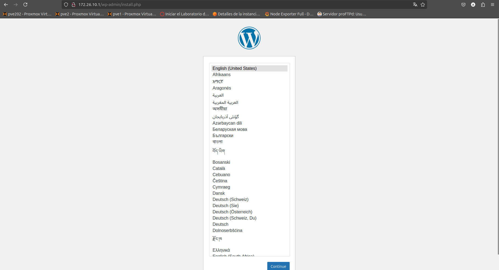
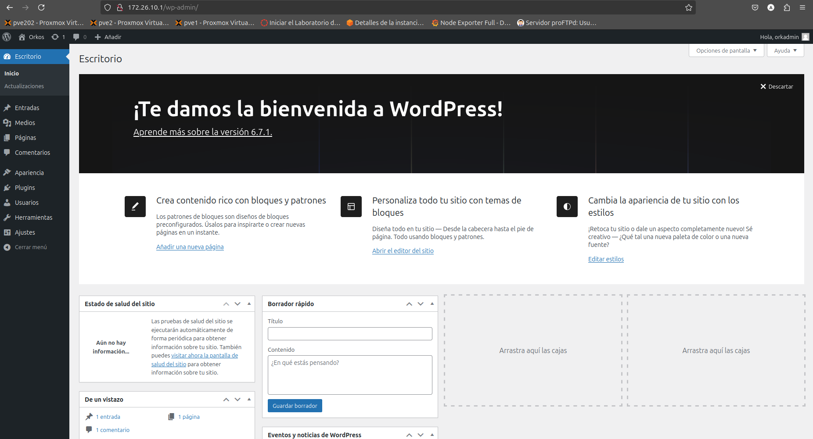

# Manual de instalación de Wordpress

## Introducción

Wordpress puede ser instalado de varias maneras, desde manualmente hasta con docker, hoy repasaremos las distintas formas.

# Instalación por Manual de Wordpress

La instalacion manual de wordpress tiende a ser la mas complicada pero sigue en si siendo un proceso sencillo:

## Paso 1: Preparación del Servidor

Este paso es común entre todas las formas de instalar wordpress, en este caso trabajaremos con una maquina Debian 12 con las siguientes especificaciones:

### Características de la maquina:

* 4G de ram
* 4 procesadores (2 sockets y 2 cores)
* 50G de almacenamiento
* SO Debian 12

## Paso 2 Instalación de dependencias

### Instala los componentes necesarios:
~~~bash
apt update && apt upgrade -y
apt install apache2 mariadb-server php php-mysql libapache2-mod-php unzip wget -y
~~~

### Habilita y verifica los servicios:
~~~bash
systemctl enable apache2
systemctl enable mariadb
systemctl start apache2
systemctl start mariadb
~~~

## Paso 3 Configurar MariaDB
### Ejecuta el script de configuración segura:
~~~bash
mysql_secure_installation
~~~
### Sigue las indicaciones:
1. Establece una contraseña para el usuario root.
2. Elimina usuarios anónimos.
3. Prohíbe el acceso remoto para el usuario root.
4. Elimina la base de datos de prueba.
5. Recarga los privilegios.

### Crear una base de datos para WordPress:
~~~ bash
mysql -u root -p
~~~

Ejecuta los siguientes comandos dentro del cliente MariaDB:
~~~sql
CREATE DATABASE wordpress;
CREATE USER 'wordpress_user'@'localhost' IDENTIFIED BY 'peque';
GRANT ALL PRIVILEGES ON wordpress.* TO 'wordpress_user'@'localhost';
FLUSH PRIVILEGES;
EXIT;
~~~

## Paso 3 Descargar e instalar WordPress

### Descargamos la última versión de wordpress.

~~~bash
wget https://wordpress.org/latest.zip
~~~
### Extrae los archivos:
~~~bash
unzip latest.zip
mv wordpress /var/www/html/
~~~
### Ajusta los permisos:
~~~bash
chown -R www-data:www-data /var/www/html/wordpress
chmod -R 755 /var/www/html/wordpress
~~~

## Paso 4 Configuración de Apache
### Crea un archivo de configuración para WordPress:
~~~bash
cd /etc/apache2/sites-available
cp 000-default.conf wordpress.conf
nano wordpress.conf
~~~
Contenido del archivo:
~~~xml
<VirtualHost *:80>
    ServerAdmin admin@tu-dominio.com
    DocumentRoot /var/www/html/wordpress
    ServerName tu-dominio.com
    ServerAlias www.tu-dominio.com

    <Directory /var/www/html/wordpress>
        AllowOverride All
    </Directory>

    ErrorLog ${APACHE_LOG_DIR}/wordpress_error.log
    CustomLog ${APACHE_LOG_DIR}/wordpress_access.log combined
</VirtualHost>
~~~
### Habilita la configuración y el módulo de reescritura:
~~~bash
a2dissite 000-default.conf
a2ensite wordpress.conf
a2enmod rewrite
systemctl reload apache2
~~~

El módulo rewrite de Apache se necesita para habilitar URLs amigables en WordPress. Permite redirigir y reescribir solicitudes, lo cual es crucial para que los enlaces permanentes de WordPress funcionen correctamente.

## Paso 5 configuración del Wordpress

### Copia el archivo de configuración predeterminado:
~~~bash
cp /var/www/html/wordpress/wp-config-sample.php /var/www/html/wordpress/wp-config.php
~~~
### Edita el archivo de configuración:
~~~bash
nano /var/www/html/wordpress/wp-config.php
~~~
Modifica las siguientes líneas con los datos de tu base de datos:
~~~php
define('DB_NAME', 'wordpress');
define('DB_USER', 'wordpress_user');
define('DB_PASSWORD', 'peque');
define('DB_HOST', 'localhost');
define('DB_CHARSET', 'utf8mb4');
define('DB_COLLATE', '');
~~~
### Configura las claves de seguridad:
Genera claves únicas desde: https://api.wordpress.org/secret-key/1.1/salt/
#### Caso de ejemplo:
~~~php
define('AUTH_KEY',         'izz[e)6kJwuGNy_+!#W#W+)aP.R#8Ta=~.%gj>ABE{T_aY%+.lp}4RaOgY$F#uJ,');
define('SECURE_AUTH_KEY',  '`]Z5F-8m9;k$G+,0C9t8]p^F<+Ox+N|w9JY8qMTetN1U/o6[xwSce7pV.HHETV}*');
define('LOGGED_IN_KEY',    '4^Rm/ BI$rTUB+Hl+WKjX0s%hTf$|&U{b+&,$+|/=4l{2P$.*(/?2+.1yi>@m(4l');
define('NONCE_KEY',        'U]0,D T}-6428!ILi`e=|D^Sb1=(W@P`+R!#sE+zKGFizYNBBM`8`i(IcdFBjtU ');
define('AUTH_SALT',        '$;SZFgjyBslB,6}[I^WkU$~3N1R/BT4+Y(K@37[S+llF}$jH{%M/U=f|d!:(5_8Z');
define('SECURE_AUTH_SALT', ']t BE`tq8-i3B7=-V;%/X,3AZ`l@nJu/,!hH,*|b+)%<||$Qk/~x&O2uEH,!PFQ/');
define('LOGGED_IN_SALT',   'UjR[jvusq=)4dEu@@Y5DdC$xH^fLEkP,V+j>;YV@(_sP)=_oE|AlbMYNS@DQ*U ~');
define('NONCE_SALT',       'IQ#|kW e+3X?/]|A7BTOLKbjp4C@a`c4IH;Wi)KXJ`uB(Y/,U-Gh(,]uWlse(,]v');
~~~

Sustitúyelas en el archivo wp-config.php.

## Paso 6 Configuración de permisos de Apache

Asegúrate de que Apache puede escribir en el directorio necesario:
~~~bash
chmod -R 775 /var/www/html/wordpress/wp-content
chown -R www-data:www-data /var/www/html/wordpress/wp-content
~~~

## Paso 7 Acceso al instalador web
Abre tu navegador y accede a: http://IP_DEL_SERVIDOR
Deberías de encontrar una  pagina como esta:

Completa el asistente de instalación proporcionando:
* Nombre del sitio.
* Usuario y contraseña del administrador.
* Correo electrónico.
* Una vez finalizado, accede al panel de administración en http://tu-dominio.com/wp-admin.

---

## Instalación por Docker Run

## Paso 1: Preparación del Servidor

Este paso es común entre todas las formas de instalar wordpress, en este caso trabajaremos con una maquina Debian 12 con las siguientes especificaciones:

### Características de la maquina:

* 4G de ram
* 4 procesadores (2 sockets y 2 cores)
* 50G de almacenamiento
* SO Debian 12

## Paso 2 Instalación de dependencias

Ne este caso necesitaremos tener instalado docker.

~~~ bash
apt update && apt upgrade -y
apt install apt-transport-https ca-certificates curl software-properties-common gnupg lsb-release -y
~~~

## Paso 3 Instalar Docker
### Agregar la clave GPG oficial de Docker
~~~bash
sudo mkdir -p /etc/apt/keyrings
curl -fsSL https://download.docker.com/linux/debian/gpg | sudo gpg --dearmor -o /etc/apt/keyrings/docker.gpg
~~~
### Agregar el repositorio de Docker
~~~bash
echo "deb [arch=$(dpkg --print-architecture) signed-by=/etc/apt/keyrings/docker.gpg] https://download.docker.com/linux/debian $(lsb_release -cs) stable" | sudo tee /etc/apt/sources.list.d/docker.list > dev/null
~~~
### Actualizar e instalar Docker
~~~bash
sudo apt update
sudo apt install docker-ce docker-ce-cli containerd.io docker-buildx-plugin docker-compose-plugin -y
~~~
